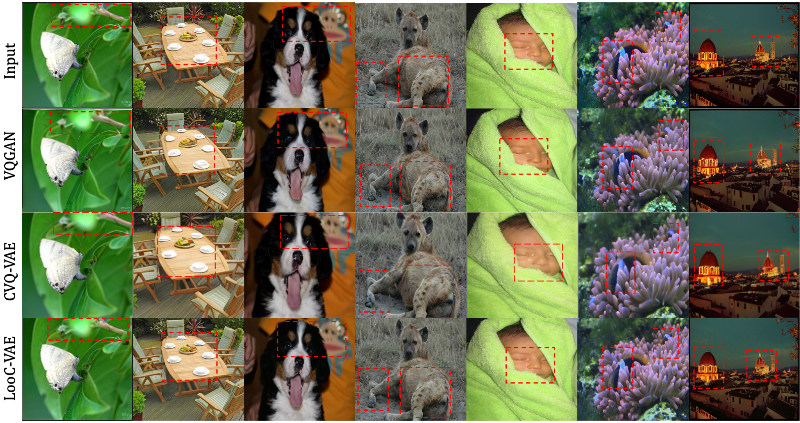

# LooC

[paper]() | [arXiv]() | [Project](https://visual-ai.github.io/looc/) | 

This repository implements the training, testing and evaluation code for the "LooC: Effective Low-Dimensional Codebook for Compositional Vector Quantization".
Vector quantization (VQ) is a prevalent and fundamental technique that discretizes continuous feature vectors by approximating them using a codebook. This paper aims to reconcile the conflict arising from the ever-increasing diversity and complexity of data and models, which demand high-capacity yet more compact VQ methods, by presenting a new approach called **LooC** — a method that leverages an effective low-dimensional codebook for compositional vector quantization.

The code in this repository is built based on [CVQ](https://github.com/lyndonzheng/CVQ-VAE) and [VQGAN](https://github.com/CompVis/taming-transformers). As a plug-and-play module, LOOC can directly replace the VQ module in the original repository for immediate use.

## Examples

- Reconstruction


- Generation


## Getting starrted
- Clone this repos:
```
git clone link
cd looc
```

## Requirements
The original model is trained and evaluated with Pytorch 1.13.1. We fixed all random seeds. The users should be able to achieve the same performance as the quantitative and qualitative results reported in the paper.

A suitable [conda](https://conda.io/) environment named `looc` can be created and activated with:

```
conda env create -f environment.yaml
conda activate looc
```

## Model Training

Training can be started by running:
```
CUDA_VISIBLE_DEVICES=<GPU_ID> python main.py \
--data_folder <data_path>/mnist \
--dataset mnist \
--output_folder <output_path> \
--exp_name mnist_cos_closest \
--batch_size 1024 \
--device cuda \
--num_epochs 500 \
--num_embedding 512 \
--embedding_dim 64 \
--distance cos \
--anchor closest 
```

For ablation study optional arguments:
```
--num_embedding 
                    number of codebook [32, 64, 128, 256, 512, 1024] for table 4(a)
--embedding_dim
                    dimensionality of codebook [4, 8, 16, 32, 64, 128] for table 4(b)
--anchor
                    anchor sampling methods ['closest', 'random', 'probrandom'] for table 4(c)
--first_batch
                    if true, offline version with only one-time reinitialisation for table 3
--contras_loss
                    if true, use contrastive loss for table 3
```

## Model Testing with codebook analysis

```
CUDA_VISIBLE_DEVICES=<GPU_ID> python test.py \
--data_folder <data_path>/mnist \
--dataset mnist \
--output_folder <output_path> \
--model_name mnist_cos_closest/best.pt \
--batch_size 16 \
--device cuda \
--num_embedding 512 \
--embedding_dim 64 \
--distance cos 
```
For ablation study, the users just need to modify the corresponding optional arguments as in training

The default results will be stored under the ```<output_folder>/results/<model_name>``` folder, in which:
- ```original/```: shows original images
- ```rec/```: shows reconstruction images

## Model Evaluation

```
CUDA_VISIBLE_DEVICES=<GPU_ID> python evaluation.py \
--gt_path <output_folder>/results/<model_name>/original/ \
-g_path <output_folder>/results/<model_name>/rec
```

## Model Application
The users just need to replace the quansiser in [VQGAN](https://github.com/CompVis/taming-transformers) for ffhq and imagenet reconstruction and [LDM](https://github.com/CompVis/latent-diffusion) for lsun generation.


## License
This work is licensed under a MIT License.

This software is for educational and academic research purposes only. If you wish to obtain a commercial royalty bearing license to this software, please contact us.

## Citation

If you use this code for your research, please cite our papers.
```

@inproceedings{li26wacv,
    author    = {Li, Jie and Wong, Kwan-Yee~K. and Han, Kai},
    title     = {LooC: Effective Low-Dimensional Codebook for Compositional Vector Quantization},
    booktitle = {Proc. Winter Conference on Applications of Computer Vision},
    address   = {Tucson, Arizona, USA},
    month     = {March},
    year      = {2026}
}
```
